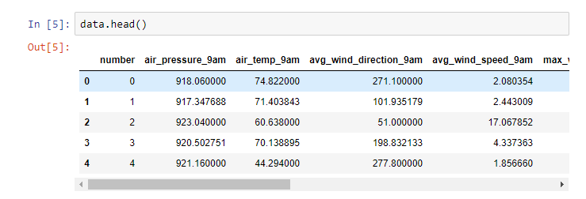

# ML - Decision Tree - Meteorology

Machine learning project with Python.

## Description

Using Machine Learning we seek to create an effective decision tree model to predict the wheater of a given dataset region.

## Used Tools

- Python
- Jupyter notebook
- Pandas
- Sklearn

## Dataset

- https://drive.google.com/drive/folders/1CgMQBjFZPCgMln-L7rZ5urB-q1vNSEGs

## Captures

### Dataset:

### Results:

